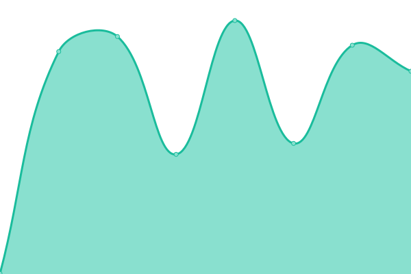

# [📈 Live Status](https://jcuenod.github.io/upptime): <!--live status--> **🟩 All systems operational**

This repository contains the open-source uptime monitor and status page for [James Cuénod](https://parabible.com), powered by [Upptime](https://github.com/upptime/upptime).

With [Upptime](https://upptime.js.org), you can get your own unlimited and free uptime monitor and status page, powered entirely by a GitHub repository. We use [Issues](https://github.com/jcuenod/upptime/issues) as incident reports, [Actions](https://github.com/jcuenod/upptime/actions) as uptime monitors, and [Pages](https://jcuenod.github.io/upptime) for the status page.

<!--start: status pages-->
<!-- This summary is generated by Upptime (https://github.com/upptime/upptime) -->
<!-- Do not edit this manually, your changes will be overwritten -->
<!-- prettier-ignore -->
| URL | Status | History | Response Time | Uptime |
| --- | ------ | ------- | ------------- | ------ |
|  [Parabible](https://parabible.com) | 🟩 Up | [parabible.yml](https://github.com/jcuenod/upptime/commits/HEAD/history/parabible.yml) | 

 255ms
     
 | 

<a href="https://jcuenod.github.io/upptime/history/parabible">100.00%</a>
    

|  [FixPDFs](https://fixpdfs.com) | 🟩 Up | [fix-pd-fs.yml](https://github.com/jcuenod/upptime/commits/HEAD/history/fix-pd-fs.yml) | 

 174ms
     
 | 

<a href="https://jcuenod.github.io/upptime/history/fix-pd-fs">100.00%</a>
    

|  [Rekindle](https://rekindle.co.za) | 🟩 Up | [rekindle.yml](https://github.com/jcuenod/upptime/commits/HEAD/history/rekindle.yml) | 

 614ms
     
 | 

<a href="https://jcuenod.github.io/upptime/history/rekindle">100.00%</a>
    

<!--end: status pages-->

[**Visit our status website →**](https://jcuenod.github.io/upptime)

## 📄 License

- Powered by: [Upptime](https://github.com/upptime/upptime)
- Code: [MIT](./LICENSE) © [James Cuénod](https://parabible.com)
- Data in the `./history` directory: [Open Database License](https://opendatacommons.org/licenses/odbl/1-0/)
